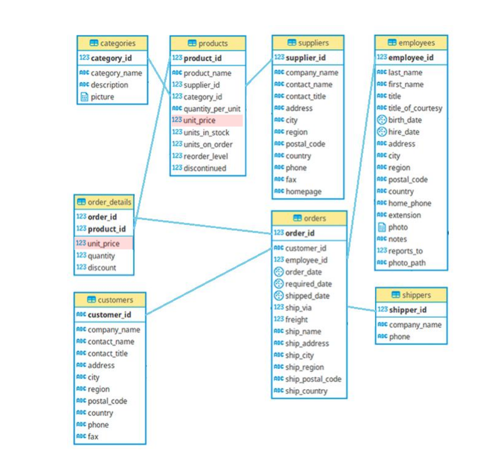

# Projeto 1: Northwind

Projeto consiste em  criar um database no redshift da amazon, povoa com dados de arquivos csv armazenados no bucket s3 e fornecer os dados solicitados nas atividades. As tabelas possuem o seguinte schema:

O codigo de criaçao das tabelas já foi fornecido, cabendo ao desenvolvedor mover os dados do bucket s3 e criar as consultas solicitadas. O arquivo **MoverDados.sql** traz o script para mover os dados do s3 para o database no redshift.

Foram pedidas 5 consultas. Os detalhes de cada consulta segue abaixo:
* **at1.sql**: Essa atividade pede para mostra os produtos que são vendidos com preços diferentes dos preços tabelados, a quantidade de produtos vendido e que estejam ordenados pela diferença.

* **at2.sql**: Essa atividade pede uma comparaçao de desempenho de cada vendedor, mostrando a quantidade de vendas feita e quanto cada vendedor arrecadou.

* **at3.sql**: Essa atividade pede os 10 produtos mais caros da empresa.

* **at4.sql**: Essa atividade pede o comportameto da empresa em relação a seus fornecedores, para saber quanto cada fornecedor arrecadou nos anos de 2020 e 2021 e a diferença entre a arrecadação nesses 2 anos.

* **at5.sql**: Essa atividade pede o top 5 de cada ano para as categorias de produtos que obtiveram a maior arrecadação.
